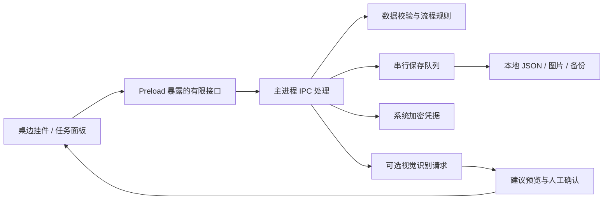

# 多线程任务助手

**跨天流程管理与等待事项跟进，让并行工作中的任务进展持续可见。**

Windows 桌面应用 · 本地记录 · 可选 AI 截图识别 · MIT 开源


一项工作往往要跨过准备、执行、等待和交付多个阶段。多线程任务助手用一条连续的任务流程，记录已经做了什么、现在停在哪里，以及下一步要做什么；通过桌边挂件，帮助你在切换工作后重新接上进度。

这里的“多线程”指同时推进多项工作。项目关注个人工作流管理。

[使用场景](#使用场景) · [软件实景](#软件实景) · [快速开始](#快速开始) · [技术设计](#技术设计) · [验证与边界](#验证与边界) · [参与贡献](CONTRIBUTING.md)

## 为什么做这个项目

### 跨天推进时，阶段之间的关系容易丢失

以日期和提醒为中心记录事情，适合回答“今天要做什么”。但一件事可能周一准备材料、周四等待反馈、周六继续修改。如果将它拆成几个分散的日期条目，我们还需要自己记住：它们属于同一个任务，当前做到哪里，后续如何衔接。

本项目以**任务的完整推进过程**为组织单位，把不同日期的进展保留在同一条流程中。日历关注何时安排，本项目关注一件事如何继续推进，两者可以配合使用。

### 并行工作时，等待中的事项容易被遗忘

等待同事回复、审批结果或 Agent 执行完成时，任务并没有结束，但你会切换到其他工作。中断时间越长，越需要重新回忆上下文。

本项目把等待阶段留在流程中，用桌边挂件显示当前进展。收到反馈后，可以直接回到中断位置，继续下一步。当前通过手动记录和推进实现，不会自动监听外部回复或 Agent 状态。

## 使用场景

| 场景 | 常见困难 | 在本项目中的使用方式 |
| --- | --- | --- |
| 产品、设计方案交付 | 需求、初稿、反馈和修改分散在不同时间 | 建立完整阶段，持续记录当前进度 |
| 开发与跨角色协作 | 多项任务交错，部分事项等待他人 | 保留等待阶段，切换任务后快速找回上下文 |
| 人与 AI 协作 | 工具执行与人工检查分开进行 | 手动记录“提交任务—等待执行—人工检查” |
| 学习、调研与资料整理 | 长期任务难以一次完成 | 将收集、整理、归纳和输出串成一条流程 |

例如，一项方案交付可以持续数天：

```text
明确需求 → 完成初稿 → 等待同事反馈 → 修改与完善 → 确认交付
                         ↑ 当前阶段
```

等待反馈时切换到其他任务；反馈到达后，再回到这条流程推进。历史记录保留此前的上下文。

## 软件实景

应用提供两种视图：**细长的桌边流程挂件**，以及**带层叠任务卡片的管理面板**。


上方宣传图与桌面场景基于实际界面制作；以下为应用直接截取的原始截图，均使用虚构演示任务。

<p align="center">
  
  &nbsp;&nbsp;
  
</p>

## 当前功能

| 功能 | 当前实现 |
| --- | --- |
| 分阶段流程 | 为任务填写有序步骤，标记当前阶段，逐步推进；单条流程最多 100 步 |
| 并行任务切换 | 在任务面板和流程挂件中切换不同事项 |
| 桌边查看 | 支持左右停靠、边缘展开/收起、固定展开与显示器选择 |
| 进展记录 | 追加节点、备注与截图，保留历史上下文 |
| 完成与归档 | 完成流程或归档任务，并保留相关记录 |
| 撤销与备份 | 运行期间撤销、本地备份恢复、工作区导入/导出 |
| 可选截图识别 | 调用智谱视觉接口，生成可编辑的任务和后续步骤建议，确认后保存 |
| 语音输入 | 调起 Windows 听写，将文字输入当前表单 |

### 一次典型使用流程

1. 创建一项任务，逐行填写计划步骤，例如“明确需求、完成初稿、等待反馈、修改、交付”。
2. 在当前阶段记录进展，需要时附上截图或备注。
3. 遇到等待环节时保留该阶段，切换到其他任务继续工作。
4. 收到反馈后回到原任务，推进到下一步；误操作可以撤销。
5. 完成后保留记录，定期导出工作区备份。

截图识别是可选入口：附图 → 点击“识别并规划” → 检查依据与建议 → 填入表单 → 编辑并保存。

## 快速开始

### 环境要求

- Windows x64。
- Node.js 24 与 npm。
- Git；也可以从仓库下载源码 ZIP 并解压。

当前首页提供源码运行与本地打包方式，不假设已经发布可直接下载的安装包。

```powershell
git clone https://github.com/Betonme519/parallel-task-assistant.git
cd parallel-task-assistant
npm ci
npm start
```

如果已下载源码 ZIP，在解压后的项目根目录执行 `npm ci` 和 `npm start`。若安装环境跳过了 Electron 二进制下载，执行 `node node_modules/electron/install.js` 后再启动。

**手动管理任务不需要 API 密钥。** 截图识别可在设置中配置自己的智谱密钥，也支持进程环境变量 `FLOWLINE_GLM_API_KEY`；项目不会自动读取 `.env` 文件。详见 [AI 接入说明](docs/AI-INTEGRATION.md)。

### 构建便携版

```powershell
npm run package
```

输出目录为 `release-public/Flowline-win32-x64/`。双击其中的 `Flowline.exe`，或在项目根目录双击 `START.cmd`。便携版需要保留整个输出目录，不能只复制一个 EXE。

构建拒绝覆盖已有输出；再次构建前请妥善移走旧输出。公开分发应使用未写入个人任务的干净构建。部分包名、输出路径与 `.flowline` 备份扩展名保留项目早期标识，以兼容已有数据和启动脚本。

## 技术设计

项目基于 Electron，使用 JavaScript、HTML 与 CSS；业务模型采用 CommonJS 模块，界面代码使用浏览器模块。Node 内置测试框架覆盖业务规则，Playwright 用于真实 Electron 界面测试。具体依赖版本见 [package.json](package.json)。



### 关键设计与取舍

| 设计问题 | 当前方案 | 代码入口 |
| --- | --- | --- |
| 如何同时表达计划与实际进展 | 有序步骤和当前索引描述流程，时间节点保存已发生的记录 | [流程模型](src/core/workflow.cjs)、[任务模型](src/core/model.cjs) |
| 连续操作如何避免相互覆盖 | 通过 Promise 队列串行保存，落盘成功后更新内存状态 | [存储实现](src/main/store.cjs) |
| 记录损坏时如何避免丢失更多数据 | 校验工作区，尝试恢复有效备份；无法恢复时停止启动并保留原件 | [恢复逻辑](src/main/store.cjs) |
| 桌面界面如何访问系统能力 | 渲染进程关闭 Node 集成，启用上下文隔离，经有限的 Preload / IPC 接口访问主进程 | [Preload](src/main/preload.cjs)、[主进程](src/main/index.cjs) |
| 如何让 AI 辅助而不直接替用户修改记录 | 解析并校验输出，把未来步骤标为建议，预览后由用户确认保存 | [视觉识别](src/main/ai.cjs)、[界面交互](src/renderer/capture.js) |
| 如何管理本地 API 密钥 | 主进程通过系统加密能力保存，渲染端获得配置状态 | [凭据实现](src/main/credentials.cjs) |

本地 JSON 存储便于个人使用与备份，也意味着当前没有跨设备同步和多人并发编辑。等待阶段由使用者维护，因此不需要接入聊天或 Agent 平台，但也无法自动获知外部任务的最新状态。

详细设计、数据流和限制见 [架构说明](docs/ARCHITECTURE.md)。

## 验证与边界

在项目根目录执行：

```powershell
npm run check          # JavaScript 语法检查
npm test               # 模型、流程、存储与 AI 单元测试
npm run test:e2e       # 当前界面的 Electron 交互测试
npm run check:privacy  # Git 发布候选文件的启发式隐私扫描
```

单元测试覆盖流程推进、输入校验、归档与撤销、并发保存、写入失败、损坏恢复，以及 AI 响应解析、无密钥行为和有限重试。当前界面测试覆盖创建、编辑、添加阶段、推进流程和历史保留。测试使用隔离数据目录。

测试覆盖与人工验证范围见 [验证说明](docs/VERIFICATION.md)。没有把自动化测试结果等同于所有 Windows 设备的兼容性验证。

当前未实现自动日历排期、到期提醒、外部回复监听、Agent 完成监听、云同步、多人协作或跨平台发布。多显示器与不同 DPI 的实际设备组合仍需持续验证。

## 数据与隐私

手动任务与截图保存在本机，开发模式默认为项目根目录的 `data/`，新便携版默认为程序旁的 `data/`。设置页显示实际位置；`FLOWLINE_DATA_DIR` 可指定其他目录。

- 工作区文字、截图及导出备份不是加密存储。
- 专用凭据使用系统加密保存，源码与专用备份导出流程不附带该凭据文件。
- 点击截图识别时，当前截图、补充说明和相关任务上下文会发送给智谱。
- Windows 听写由操作系统处理，可能依赖在线语音服务。
- 导出的备份仍可能包含手动写入、粘贴或截图中的敏感内容，不会自动脱敏。

详见 [隐私与发布检查](SECURITY.md)。

## 后续方向

以下为可讨论的演进方向，不代表已经交付或承诺发布时间：

- 更清晰的等待原因与跟进时间记录。
- 自定义流程模板与任务检索。
- 可访问性、键盘操作及多显示器兼容性完善。
- 在用户明确授权的前提下，探索外部事件更新与提醒。

## 参与贡献与反馈

欢迎提交使用问题、交互建议和代码改进。问题反馈请说明系统环境、复现步骤、预期行为与实际结果，图片中请使用虚构或脱敏数据。

- [提交 Issue](https://github.com/Betonme519/parallel-task-assistant/issues)
- [贡献指南](CONTRIBUTING.md)
- [架构说明](docs/ARCHITECTURE.md)
- [AI 接入说明](docs/AI-INTEGRATION.md)
- [验证说明](docs/VERIFICATION.md)

项目由 [@Betonme519](https://github.com/Betonme519) 维护。

## 开源许可

本项目使用 [MIT License](LICENSE)。
