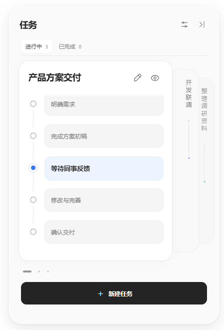
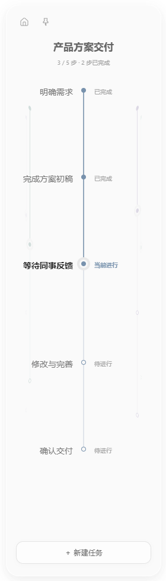

# 多线程任务助手

**跨天流程管理与等待事项跟进。**


*基于实际软件截图制作的宣传图；以下附原始界面截图。*

把一件事的阶段、当前进展和下一步串在一起，让等待中的任务也能留在视野里。

## 桌面上的实际形态


*桌面场景为合成展示。以下为应用直接截取的真实界面，使用虚构演示任务。*

<p align="center">
  
  &nbsp;&nbsp;
  
</p>

## 为什么做多线程任务助手

真实工作往往无法在一个待办项或一个日历时间块中完成。一项任务可能周一准备材料、周四等待反馈、周六继续修改。按日期分散记录时，我们需要自己记住这些片段属于同一件事，以及它们之间的关系。

与此同时，多项工作经常并行推进。有的正在处理，有的等待同事回复、审批结果或 AI Agent 运行结束。等待会打断工作的连续性；切换到其他事情后，尚未完成的任务容易被遗忘。

多线程任务助手从这两个问题出发：以任务为单位保留完整流程，以桌面侧边挂件呈现当前进展，帮助使用者在跨天推进和频繁切换时恢复上下文。

## 适合什么场景

- **长期事项分阶段推进**：把资料准备、讨论、修改和交付放在同一条流程中，持续记录跨天进展。
- **多项工作并行处理**：切换任务时查看当前阶段、历史节点与下一步，减少重新梳理上下文的成本。
- **外部依赖造成的等待**：记录“等待反馈”等状态及待跟进事项，保留中断位置，方便之后继续。
- **人与 AI 协作**：手动记录 Agent 执行与人工检查阶段，让异步工作保留可回看的线索。

例如，一次方案交付可以组织为：

```text
整理需求 → 形成初稿 → 等待反馈 → 修改方案 → 交付确认
                       ↑ 当前阶段
```

等待时可以切换到其他任务；收到反馈后，再回到这条流程继续推进。

## 当前能力

- 桌面边缘展开/收起，支持左右停靠、显示器选择与固定展开。
- 任务流程、当前步骤、历史节点、下一步说明，以及完成与归档管理。
- 流程挂件切换任务，逐步推进并支持撤销；单条流程最多 100 步。
- 添加、粘贴与回看截图，让进展记录带上上下文。
- 可选截图识别：通过智谱接口生成可编辑的任务与后续步骤建议，确认后再保存。
- 调用 Windows 听写输入文字。
- 本地工作区保存、备份恢复，以及包含任务和关联截图的导入/导出。

**能力边界**：目前没有自动跟踪他人回复、自动监听 Agent 完成、定时催办、云同步或多人协作。跨天流程通过手动阶段推进与记录呈现，并非自动日历排期系统。

## 开始使用

当前面向 Windows x64，开发使用 Node.js 24 与 npm。源码仓库不附带依赖、个人数据或已使用过的便携版。

```powershell
cd Flowline
npm ci
npm start
```

如果将本目录作为仓库根目录，省略 `cd Flowline`。若安装环境跳过了 Electron 二进制下载，可执行 `node node_modules/electron/install.js`。

手动管理任务无需 API 密钥。截图识别可在设置中自行配置智谱密钥；也可通过进程环境变量 `FLOWLINE_GLM_API_KEY` 提供。项目不会自动读取 `.env`。

## 构建与验证

```powershell
npm run check
npm test
npm run test:e2e
npm run package
```

新构建输出到 `release-public/Flowline-win32-x64/`，不复制已有工作区。构建拒绝覆盖已有输出；再次构建前请妥善移走旧输出。双击 `START.cmd` 优先启动新构建，也兼容旧便携版入口。

**发布便携版前不要直接使用自己的日常运行目录**：程序运行后会产生个人数据。应发布未运行过的干净构建。

## 数据与隐私

手动任务与截图保存在本机。开发模式默认为本目录 `data/`，新便携版默认为程序旁的 `data/`。旧 `release-v2` 布局兼容旧版 `release` 数据位置。`FLOWLINE_DATA_DIR` 可覆盖位置，设置页显示实际路径。

- `workspace.json` 与备份包含任务内容；`images/` 包含截图；这些文件不应公开。
- 设置中保存的 API 密钥由 Electron `safeStorage` 加密，位于 `ai-credentials.json`；加密文件也不应提交。
- 点击“识别并规划”会将当前截图、补充说明，以及更新任务时的任务标题、当前阶段与流程步骤发送给智谱。请先裁剪或遮挡不希望发送的内容。
- Windows 听写由系统处理，可能需要在线语音服务。
- 导出的 `.flowline` 备份不包含专用凭据文件，但包含任务文字与截图；其中手动写入或拍到的秘密不会自动脱敏。

详见 [隐私与发布检查](SECURITY.md) 和 [AI 接入说明](docs/AI-INTEGRATION.md)。

## 代码结构

```text
src/core/       数据模型、流程推进与校验
src/main/       Electron 主进程、保存、凭据、AI 与系统集成
src/renderer/   桌面挂件、主页与交互
src/contracts.d.ts  数据接口类型
scripts/        语法检查、隐私扫描与干净打包
tests/          单元测试与桌面交互测试
docs/           公开技术说明
```

业务规则与桌面集成分层；保存通过队列串行执行，落盘成功后才更新状态。渲染进程启用上下文隔离并禁用 Node 集成，AI 请求和凭据读取在主进程中执行。

## 开源许可

[MIT](LICENSE)
